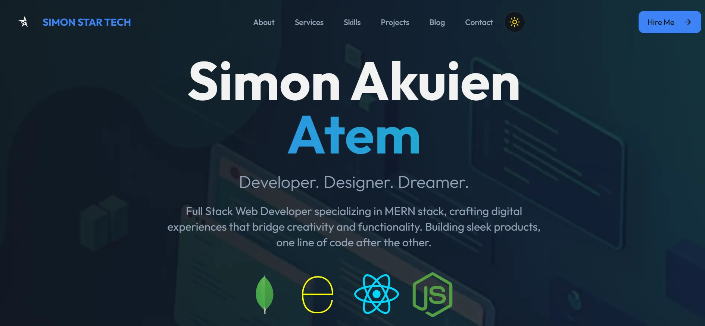

# Simon Akuien Atem – Portfolio



## Overview

This is the personal portfolio of Simon Akuien Atem, a Full Stack Web Developer specializing in the MERN stack. The site showcases Simon's skills, projects, blog, and services, and is designed with a modern, responsive UI and smooth light/dark mode switching.

## Features

- **Responsive Design**: Looks great on all devices.
- **Light/Dark Mode**: Toggle between light and dark themes with a single click.
- **Animated Hero Section**: Eye-catching introduction with smooth transitions.
- **Projects Gallery**: Highlights featured work with images and links.
- **Skills & Services**: Clearly displays technical skills and offerings.
- **Blog**: Shares insights, tutorials, and updates.
- **Contact & Email Subscription**: Easy ways for visitors to get in touch or subscribe.
- **Accessible & Fast**: Built with accessibility and performance in mind.

## Tech Stack

- **React** (with Vite)
- **TypeScript**
- **Tailwind CSS**
- **Lucide React Icons**
- **AOS (Animate On Scroll)**
- **Netlify** (for deployment)

## Getting Started

1. **Clone the repository:**
   ```bash
   git clone https://github.com/akuienistic/portfolio.git
   cd portfolio
   ```
2. **Install dependencies:**
   ```bash
   npm install
   # or
   bun install
   ```
3. **Run the development server:**
   ```bash
   npm run dev
   # or
   bun run dev
   ```
4. **Build for production:**
   ```bash
   npm run build
   # or
   bun run build
   ```

## Folder Structure

- `src/components/` – All React components (Navigation, Hero, Projects, etc.)
- `src/pages/` – Main page layout
- `src/assets/` – Images and static assets
- `src/hooks/` – Custom React hooks (e.g., useTheme)
- `public/` – Static files (favicons, robots.txt, etc.)

## Customization

- **Logo:** Replace `src/assets/STAR LOGO BLACK PNG.png.webp` and `src/assets/STAR LOGO WHITE PNG.png.webp` for your own branding.
- **Content:** Edit the components in `src/components/` and data arrays to update skills, projects, and blog posts.
- **Theme:** Tweak Tailwind config and CSS for your preferred color palette.

## Credits

- Designed & built by [Simon Akuien Atem](https://www.linkedin.com/in/simon-akuien-atem-710895290)
- Logo and visuals © Simon Star Tech

---

> Building sleek products, one line of code after the other.
